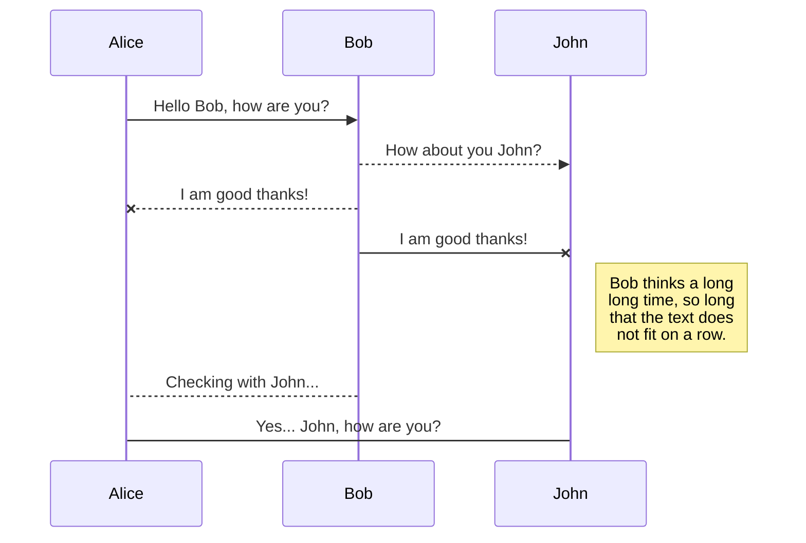
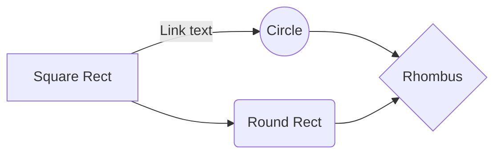

# Visit Plan WebApp

###Features

- Support Standard Markdown / CommonMark and GFM(GitHub Flavored Markdown);
- Full-featured: Real-time Preview, Image (cross-domain) upload, Preformatted text/Code blocks/Tables insert, Code fold, Search replace, Read only, Themes, Multi-languages, L18n, HTML entities, Code syntax highlighting...;
- Markdown Extras : Support ToC (Table of Contents), Emoji, Task lists, @Links...;
- Compatible with all major browsers (IE8+), compatible Zepto.js and iPad;
- Support identification, interpretation, fliter of the HTML tags;
- Support TeX (LaTeX expressions, Based on KaTeX), Flowchart and Sequence Diagram of Markdown extended syntax;
- Support AMD/CMD (Require.js & Sea.js) Module Loader, and Custom/define editor plugins;

## UML diagrams

You can render UML diagrams using [Mermaid](https://mermaidjs.github.io/). For example, this will produce a sequence diagram:

And this will produce a flow chart:

